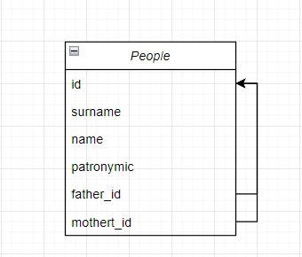
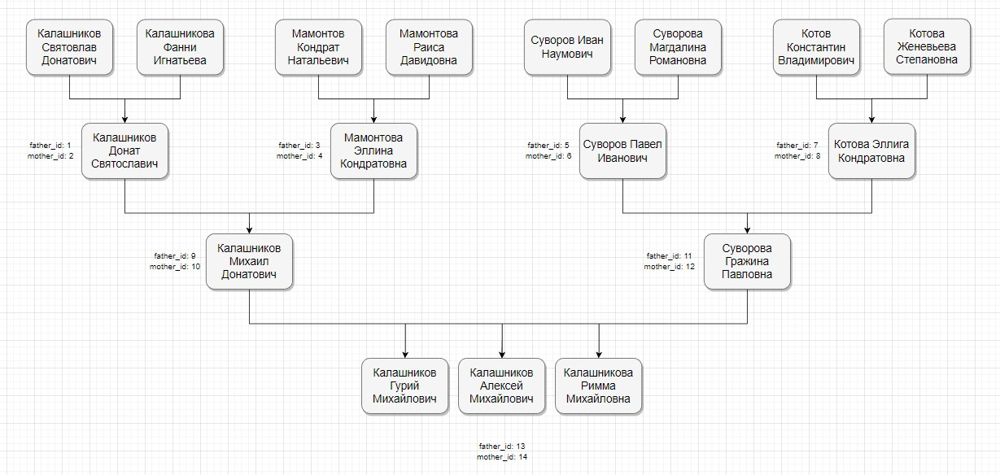

# Тестовое задание
[Sql database playground](https://www.db-fiddle.com/f/vrm4PLZAmDex52XNRtPFTJ/1)

Необходимо при помощи SQL, создать структуру БД генеологического древа с ограничением в 1 таблицу, а так же создать запрос, который выводит от найденного человека его бабушек по маминой, и папиной линии и их внуков (с ограничением в 3 внука).

Для реализации данной задачи, я воссоздал следующую таблицу БД


```sql
CREATE TABLE people ( 
  id serial PRIMARY KEY,
  surname varchar(255) NOT NULL,
  name varchar(255) NOT NULL,
  patronymic varchar(255) DEFAULT NULL,
  father_id integer REFERENCES people(id) DEFAULT NULL,
  mother_id integer REFERENCES people(id) DEFAULT NULL
);
```

И заполнил ее следующими данными


```sql
INSERT INTO people (id, surname, name, patronymic, father_id, mother_id) VALUES 
(1, 'Калашников', 'Святослав', 'Донатович', NULL, NULL),
(2, 'Калашникова', 'Фанни', 'Игнатьевна', NULL, NULL),
(3, 'Мамонтов', 'Кондрат', 'Натальевич', NULL, NULL),
(4, 'Мамонтова', 'Раиса', 'Давидовна', NULL, NULL),
(5, 'Суворов', 'Иван', 'Наумович', NULL, NULL),
(6, 'Суворова', 'Магдалина', 'Романовна', NULL, NULL),
(7, 'Котов', 'Константин', 'Владимирович', NULL, NULL),
(8, 'Котова', 'Женевьева', 'Степановна', NULL, NULL),
(9, 'Калашников', 'Донат', 'Святославич', 1, 2),
(10, 'Мамонтова', 'Эллина', 'Кондратовна', 3, 4),
(11, 'Суворов', 'Павел', 'Ивановна', 5, 6),
(12, 'Котова', 'Эллина', 'Константинович', 7, 8),
(13, 'Калашников', 'Михаил', 'Донатович', 9, 10),
(14, 'Суворова', 'Гражина', 'Павловна', 11, 12),
(15, 'Калашников', 'Гурий', 'Михайлович', 13, 14),
(16, 'Калашников', 'Алексей', 'Михайлович', 13, 14),
(17, 'Калашникова', 'Римма', 'Михайловна', 13, 14);
```

Далее воссоздал запрос который отвечает требованиям тестового задания

```sql
SELECT
  grandmothers.id,
  CONCAT(grandmothers.surname, ' ', grandmothers.name, ' ', grandmothers.patronymic) AS grandmother_fullname,
  children.id,
  CONCAT(children.surname, ' ', children.name, ' ', children.patronymic) AS grandson_fullname
FROM people
INNER JOIN people AS family
	ON 
      family.id = people.mother_id OR
      family.id = people.father_id
INNER JOIN people AS grandmothers
	ON grandmothers.id = family.mother_id
INNER JOIN people AS children
	ON 
      children.father_id = people.id OR 
      children.mother_id = people.id
WHERE 
	people.id = 14 AND -- 13/14 есть бабушки, а так же 3 ребенка, что эквивалентно 3 внукам
    (
      SELECT 
        COUNT(id)
      FROM people AS children
      WHERE 
      	children.father_id = people.id OR 
      	children.mother_id = people.id
  	) = 3
```
